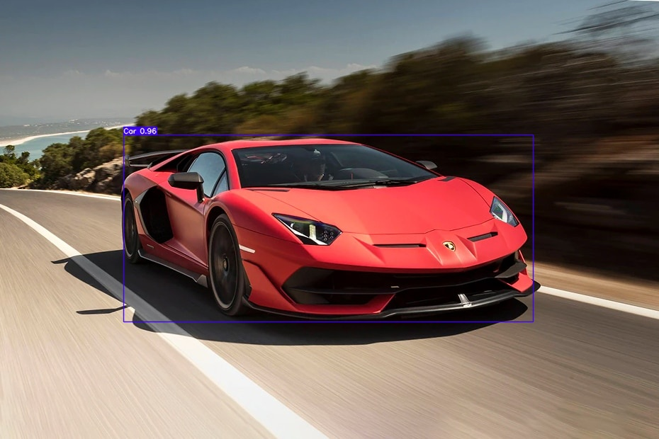

# Object Detection and Identification using Yolov7

## Training Notebook 

**Training and Evaluvation steps on custom Dataset** 

## Model File Link 

[`best.pt`](https://github.com/GouthamVicky/ObjectDetectionYoloV7/blob/main/modelWeightsFolder/best.pt)

## Detection Notebook

**Inference steps on custom Dataset** 

    

